# 相迹 PhotoTrail：纯 AI 开发的照片管理神器，让回忆触手可及

> 一款由 AI 全程参与开发的创新应用，用地图重新定义照片管理方式  
> 一个 Flutter 小白的三个月开发之旅

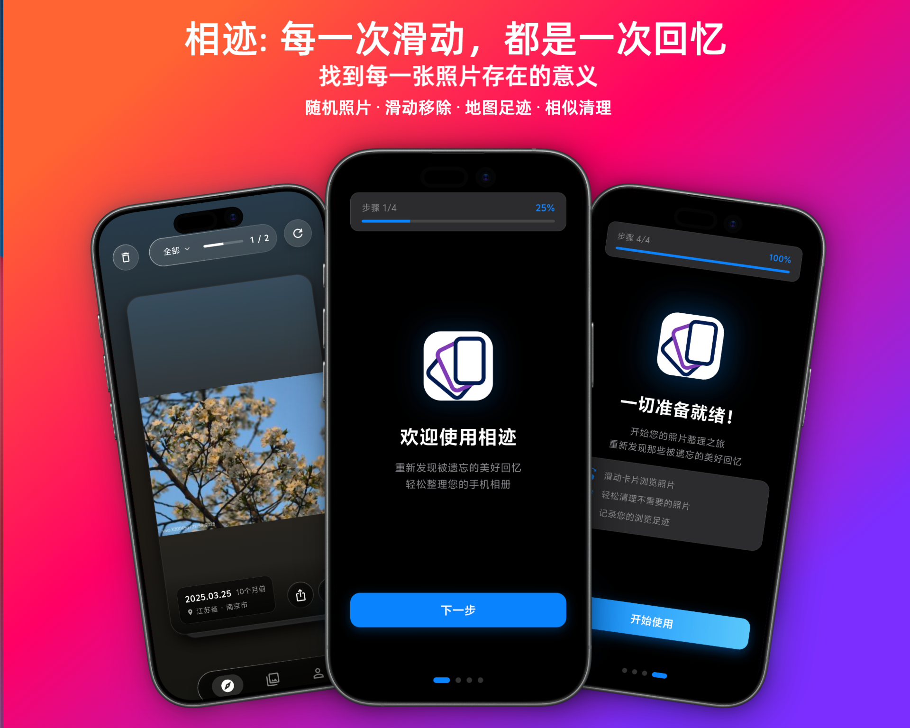

## 📑 目录导航

- [写在前面](#写在前面) - 一个零基础开发者的 AI 开发之旅
- [产品亮点](#产品亮点) - 核心功能展示
- [技术架构深度解析](#技术架构深度解析) - 技术栈与实现细节
- [AI 开发实践分享](#ai-开发实践分享从零基础到上架应用商店) - 三个月开发历程
- [开发数据统计](#开发数据统计) - 用数据说话
- [新手引导体验](#新手引导体验) - 首次使用流程
- [会员体系](#会员体系) - 免费与 VIP 功能
- [下载与使用](#下载与使用) - 获取应用
- [常见问题](#常见问题) - FAQ
- [联系与交流](#联系与交流) - 交流合作与项目转让

---

## 写在前面

你是否也有这样的困扰：手机里存了几千张照片，想找某次旅行的照片却要翻半天？想整理照片却不知从何下手？传统的相册应用只能按时间线浏览，缺乏空间维度的记忆唤醒。

今天要介绍的「相迹 PhotoTrail」，就是为了解决这个痛点而生的。更特别的是，这款应用从设计到开发，几乎完全由 AI 辅助完成，是一次人机协作的创新实践。

### 一个 Flutter 小白的 AI 开发之旅

作为一个**完全不懂 Flutter 的小白**，我在三个月前从未写过一行 Flutter 代码，甚至对移动应用开发一无所知。但借助 **Claude Code 系列 AI** 的帮助，我成功地从 0 到 1 实现了一个可以上线的完整应用。

**开发历程：**
- **开发周期**：3 个月（2025 年 11 月 - 2026 年 2 月）
- **AI 工具**：Claude Code（Claude Sonnet 4.5）
- **最终成果**：已在 vivo 应用商店上架
- **技术栈**：Flutter + Go + MySQL（全部由 AI 辅助实现）

这个项目证明了：**即使是零基础的开发者，借助 AI 也能完成复杂的应用开发**。如果你也对 AI 辅助开发感兴趣，希望这篇文章能给你一些启发。

## 🚀 快速开始

### 立即体验

1. **下载应用**
   - 📱 vivo 应用商店搜索"相迹"或"PhotoTrail"
   - 🌐 访问官网 [www.rookiefish.com](http://www.rookiefish.com) 下载 APK

2. **注册账号**
   - 使用手机号注册（支持短信验证）
   - 完成新手引导设置

3. **开始使用**
   - 授予照片和位置权限
   - 应用会自动扫描你的照片
   - 在地图上查看你的足迹
   - 滑动卡片浏览照片

### 核心功能一览

| 功能 | 说明 | 免费版 | VIP |
|------|------|--------|-----|
| 地图浏览 | 在地图上查看照片位置 | ✅ | ✅ |
| 卡片滑动 | Tinder 式照片浏览 | ✅ 限 50 张/天 | ✅ 无限制 |
| 相似照片检测 | 找出重复和相似照片 | ✅ | ✅ |
| 自定义相册 | 创建和管理相册 | ✅ | ✅ |
| 足迹统计 | 查看拍照统计数据 | ✅ | ✅ |
| 回收站 | 恢复误删的照片 | ✅ | ✅ |
| 无广告 | 纯净的使用体验 | ✅ | ✅ |

## 产品亮点

### 🗺️ 地图式照片浏览

相迹最大的特色是将照片与地理位置深度结合。应用会自动读取照片的 GPS 元数据，在地图上标注你的足迹。点击地图上的标记点，就能看到在那个地方拍摄的所有照片。

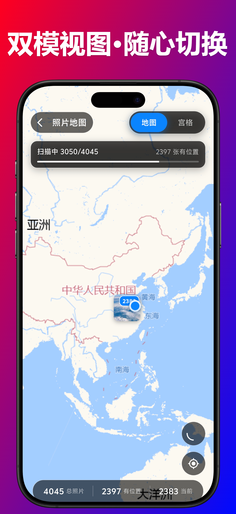

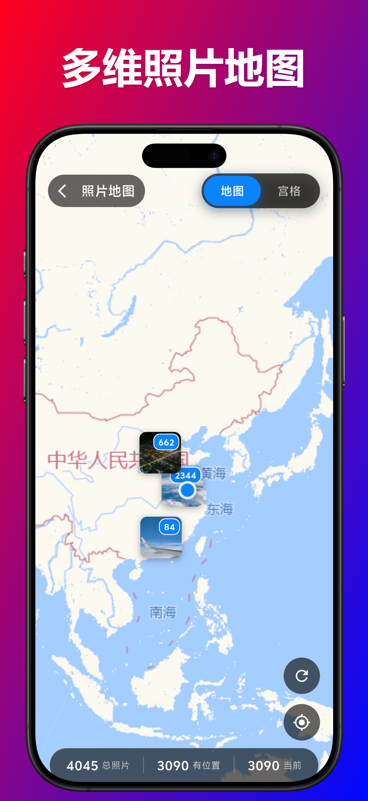

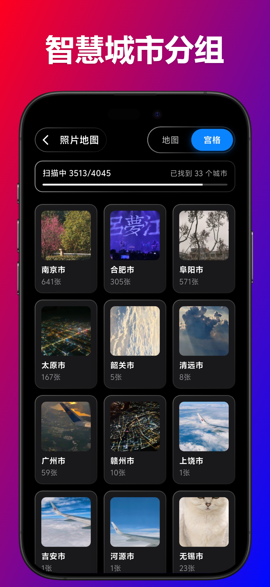

技术实现上，我们采用了：
- **GPS 元数据提取**：使用 Flutter 的 `photo_manager` 插件读取照片 EXIF 信息
- **坐标转换**：WGS-84 与 GCJ-02 坐标系转换，适配国内地图服务
- **逆地理编码**：将经纬度转换为可读的地址信息
- **标记点聚合**：使用 `flutter_map_marker_cluster` 优化大量标记点的性能

### 💳 卡片式沉浸浏览

借鉴 Tinder 的交互设计，相迹提供了极简的卡片滑动体验：
- **左滑/右滑**：标记为已浏览
- **上滑**：移入回收站
- **下滑**：撤销上一步操作

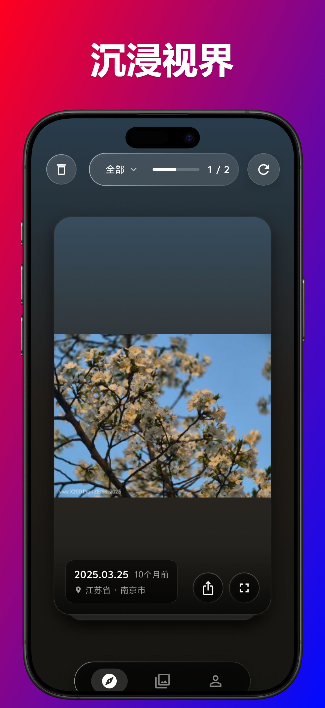


背景会根据照片主色调动态变化，营造沉浸式氛围。这个功能使用了自定义的颜色提取算法，从照片中提取主色调并生成渐变背景。

```dart
// 核心技术：颜色提取与氛围渲染
class ColorExtractor {
  Future<Color> extractDominantColor(ImageProvider image) async {
    // 使用 K-means 聚类算法提取主色调
    // 生成渐变背景效果
  }
}
```


### 📸 照片详情与智能筛选

点击照片可查看详细信息，包括拍摄时间、地点、设备信息等。支持多维度筛选：
- 按地理位置筛选
- 按时间范围筛选
- 按相册分类筛选

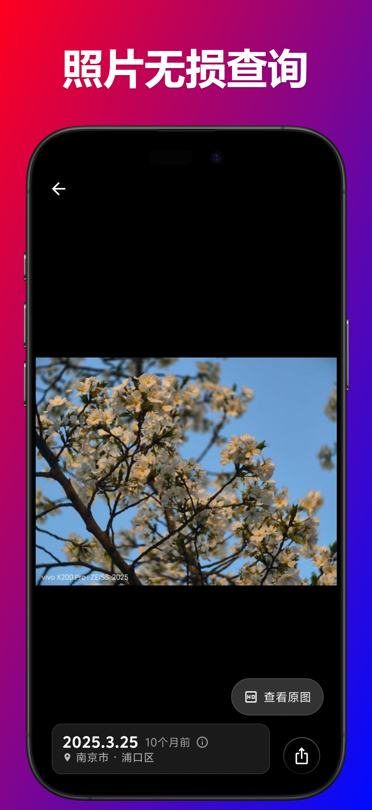


### 🔍 相似照片检测

手机里总有很多重复或相似的照片？相迹内置了相似照片检测功能，帮你快速找出并清理重复内容。

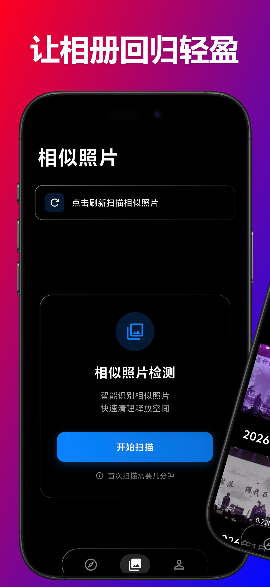

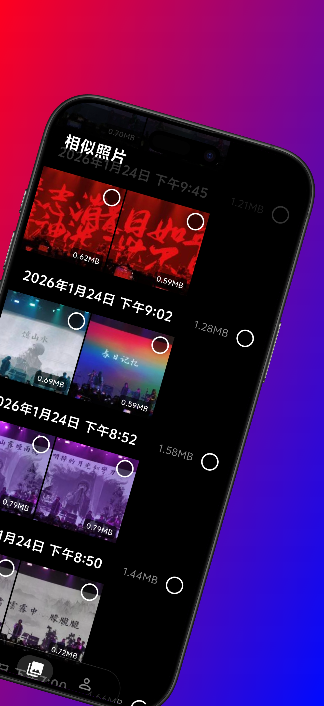

技术实现采用了感知哈希算法（pHash），计算图像的指纹并进行相似度比对：

```dart
// 相似照片检测核心算法
class SimilarPhotoDetector {
  // 1. 缩放图像到固定尺寸
  // 2. 转换为灰度图
  // 3. 计算 DCT（离散余弦变换）
  // 4. 提取低频信息生成哈希值
  // 5. 计算汉明距离判断相似度
}
```

### 📊 足迹统计与分析

自动将所以刷过的卡片放到足迹中,确保后续不会再次刷到同样的卡片


### 🗂️ 智能相册管理

支持创建自定义相册，批量选择照片进行整理。

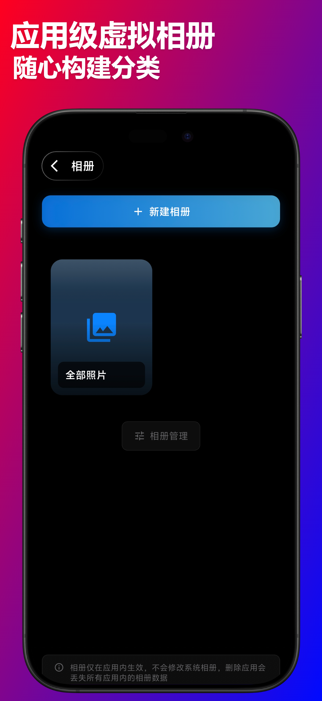

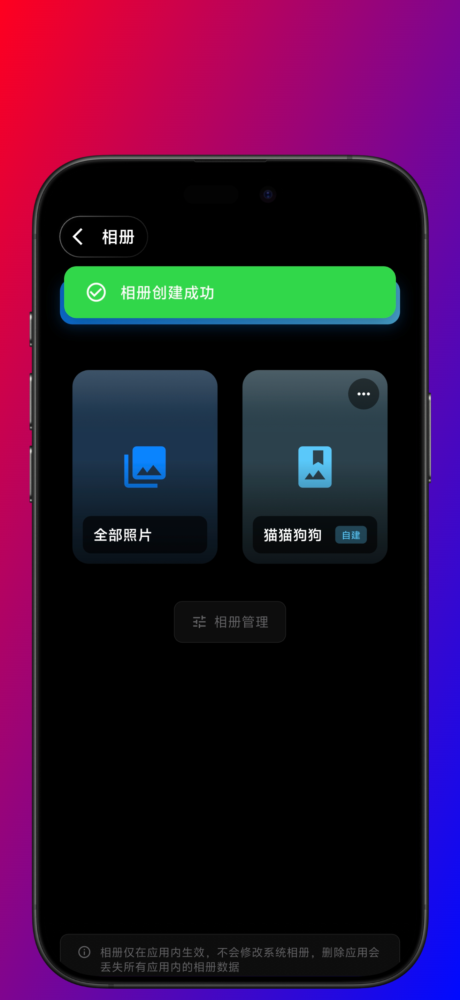

### 🗑️ 回收站与待处理箱

误删的照片可以从回收站恢复，待处理箱帮你暂存需要稍后处理的照片。

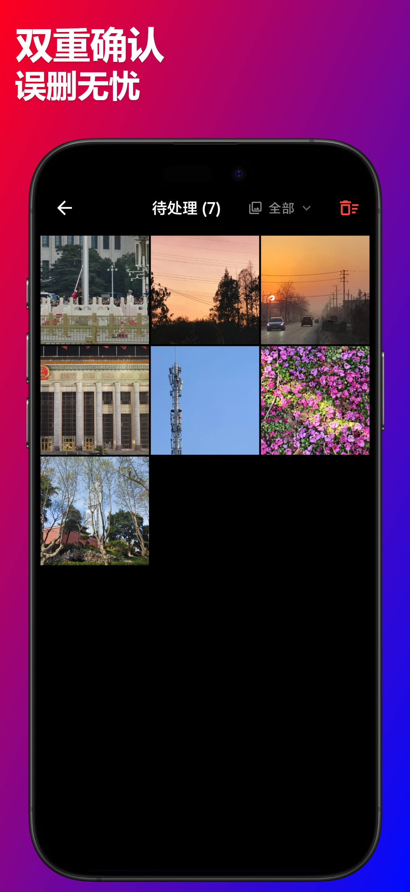

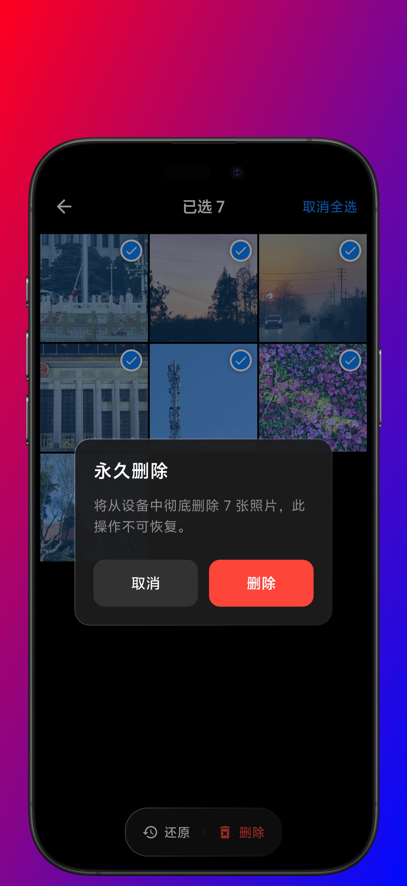

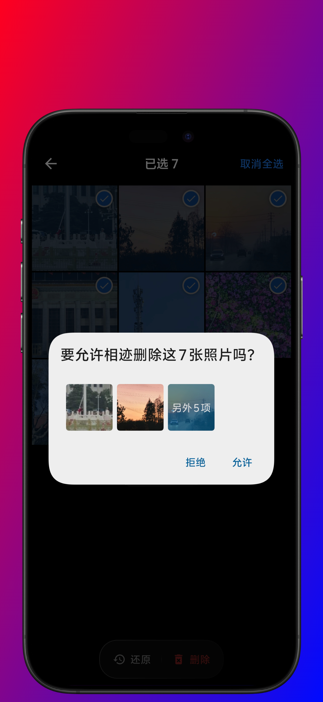


## 技术架构深度解析

作为一款由 AI 辅助开发的应用，相迹的技术栈选择和架构设计都经过了深思熟虑。

### 前端技术栈

**Flutter 3.x + Dart**

选择 Flutter 的原因：
- 跨平台开发，一套代码同时支持 Android 和 iOS
- 高性能渲染引擎，流畅的动画效果
- 丰富的插件生态，快速集成原生功能

核心依赖：
```yaml
dependencies:
  # 状态管理
  provider: ^6.1.1
  
  # 照片与媒体
  photo_manager: ^3.0.0
  image_picker: ^1.0.7
  photo_view: ^0.15.0
  
  # 地图与定位
  flutter_map: ^6.1.0
  flutter_map_marker_cluster: ^1.3.0
  geolocator: ^10.1.0
  geocoding: ^4.0.0
  
  # 网络与存储
  dio: ^5.4.0
  flutter_secure_storage: ^9.0.0
  shared_preferences: ^2.5.3
  
  # UI 交互
  flutter_card_swiper: ^7.0.0
  glassmorphism: ^3.0.0
```

### 后端技术栈

**Go + Gin + GORM + MySQL**

为什么选择 Go：
- 高性能、低内存占用
- 并发处理能力强
- 编译型语言，部署简单
- 丰富的标准库

```go
// 后端核心架构
main.go              // 应用入口
├── config/          // 配置管理
├── handlers/        // HTTP 请求处理
├── models/          // 数据模型
├── middleware/      // 中间件（认证、CORS）
└── utils/           // 工具函数（JWT、响应格式化）
```

数据库设计：
```sql
-- 核心表结构
users              -- 用户账户
user_sessions      -- 会话管理
user_settings      -- 用户设置
redeem_codes       -- VIP 兑换码
feedback           -- 用户反馈
```

### 性能优化策略

1. **图片缓存**：三级缓存机制（内存 LRU → 磁盘缓存 → 原始文件）
2. **GPS 缓存**：避免重复的逆地理编码请求
3. **地图标记聚合**：大量标记点时自动聚合，提升渲染性能
4. **懒加载**：照片列表采用虚拟滚动，按需加载
5. **后台任务**：相似照片检测等耗时操作在后台线程执行

```dart
// LRU 缓存实现示例
class ImageLRUCache {
  final int maxSize;
  final LinkedHashMap<String, Uint8List> _cache;
  
  void put(String key, Uint8List value) {
    if (_cache.length >= maxSize) {
      _cache.remove(_cache.keys.first);
    }
    _cache[key] = value;
  }
}
```


## AI 开发实践分享：从零基础到上架应用商店

这款应用的开发过程是一次有趣的人机协作实验。作为一个**完全不懂 Flutter 的小白**，我在 AI 的帮助下，用三个月时间完成了从 0 到 1 的突破。

### 我的背景

在开始这个项目之前：
- ❌ 从未接触过 Flutter 框架
- ❌ 不了解 Dart 语言
- ❌ 没有移动应用开发经验
- ❌ 对 iOS/Android 平台特性一无所知

但我有：
- ✅ 一个想法：做一款地图式照片管理应用
- ✅ 学习的热情
- ✅ Claude Code AI 作为我的导师和编程伙伴

### 三个月的开发历程

**第一个月（2025.11）：从零开始**
- 学习 Flutter 基础概念
- 搭建开发环境
- 实现基础的照片浏览功能
- 遇到无数报错，但 AI 都耐心地帮我解决

**第二个月（2025.12）：功能完善**
- 实现地图集成
- 开发卡片滑动交互
- 添加相似照片检测
- 搭建 Go 后端服务

**第三个月（2026.01-02）：打磨上线**
- 性能优化
- Bug 修复
- 用户体验优化
- 应用商店上架准备

### AI 在开发中的角色

1. **需求分析与产品设计**
   - 分析用户痛点，提出解决方案
   - 设计交互流程和功能模块
   - 规划技术架构

2. **代码实现**
   - 生成核心功能代码
   - 实现复杂算法（颜色提取、相似度检测）
   - 编写单元测试

3. **问题排查与优化**
   - 分析性能瓶颈
   - 修复 bug
   - 优化用户体验

4. **文档编写**
   - 技术文档
   - API 文档
   - 用户手册

### 开发过程中的挑战

作为一个 Flutter 小白，我遇到了很多挑战：

1. **完全陌生的技术栈**
   - 不懂 Flutter 的 Widget 树概念
   - 不了解 Dart 语言特性
   - 不知道如何调试移动应用
   - 解决方案：AI 从最基础的概念开始教我，一步步引导

2. **跨平台兼容性**
   - Android 和 iOS 的权限申请机制不同
   - 地图服务在不同平台的适配
   - 解决方案：AI 提供了针对不同平台的解决方案

3. **性能优化**
   - 大量照片加载导致内存溢出
   - 地图标记点过多导致卡顿
   - 解决方案：AI 帮我实现了多级缓存和标记点聚合

4. **用户体验细节**
   - 滑动手势的流畅度
   - 动画效果的自然度
   - 解决方案：AI 使用 Flutter 的动画系统和自定义手势识别

5. **后端开发**
   - 从未接触过 Go 语言
   - 不了解 RESTful API 设计
   - 解决方案：AI 帮我搭建了完整的后端架构

### 使用 Claude Code 的体验

**Claude Code 系列 AI** 在整个开发过程中扮演了多重角色：

1. **导师**：从零教我 Flutter 和 Dart
2. **架构师**：设计整体技术架构
3. **程序员**：编写核心代码
4. **测试员**：帮我发现和修复 Bug
5. **优化师**：提升应用性能
6. **文档员**：编写技术文档

**最让我惊讶的是：**
- AI 能理解我的需求，即使我表达得不够专业
- AI 会主动提出更好的实现方案
- AI 能解释每一行代码的作用，帮我真正理解
- AI 有耐心，不会因为我问了"愚蠢"的问题而不耐烦

### 从小白到开发者的成长

通过这三个月的开发，我从一个完全不懂 Flutter 的小白，成长为能够独立开发和维护应用的开发者。这个过程中最大的收获不仅是技术能力的提升，更是对 AI 辅助开发模式的深刻理解。

**我学到了什么：**
- **Flutter 框架**：从 Widget 树到状态管理，从零开始掌握
- **UI/UX 设计**：如何设计流畅的用户体验
- **后端开发**：Go 语言、RESTful API、数据库设计
- **调试技巧**：如何定位和解决各种 Bug
- **移动开发**：Android/iOS 平台特性和适配
- **应用上架**：从开发到上架的完整流程

**最重要的是：**
- **自信心**：证明了自己也能做出完整的产品
- **学习能力**：掌握了如何高效地与 AI 协作学习
- **产品思维**：从用户角度思考问题和解决方案

### AI 开发的优势与局限

**优势：**
- **零基础也能上手**：不需要提前学习，边做边学
- **快速原型开发**：缩短迭代周期，快速验证想法
- **代码质量稳定**：减少低级错误，遵循最佳实践
- **全栈支持**：前端、后端、数据库一站式解决
- **24/7 可用**：随时随地都能获得帮助
- **耐心教学**：不厌其烦地解释每个概念

**局限：**
- 需要人工审核和调整代码
- 复杂业务逻辑需要人工介入
- UI/UX 设计需要人工把关
- 性能调优需要实际测试
- 需要有基本的逻辑思维能力

**我的建议：**
如果你也想尝试 AI 辅助开发：
1. **从小项目开始**：不要一上来就做复杂应用，先做个简单的 Todo App
2. **多问"为什么"**：理解代码而不是盲目复制，这样才能真正学到东西
3. **遇到问题先思考**：先自己尝试解决，再向 AI 求助，培养独立思考能力
4. **保持学习心态**：AI 是助手不是替代品，要把它当作学习的工具
5. **多测试多迭代**：确保代码真正能运行，不要只看表面
6. **记录开发日志**：记录遇到的问题和解决方案，方便回顾和总结
7. **参与社区交流**：与其他开发者交流经验，互相学习

### 给想要尝试 AI 开发的朋友

如果你也想尝试 AI 辅助开发，这里有一些实用建议：

**心态准备：**
- 不要害怕犯错，错误是最好的老师
- 保持耐心，学习需要时间
- 相信自己，零基础不是障碍
- 享受过程，编程其实很有趣

**工具准备：**
- 一台电脑（Windows/Mac/Linux 都可以）
- AI 工具（Claude、ChatGPT、Cursor 等）
- 官方文档（Flutter、Go 等）
- 搜索引擎（遇到问题先搜索）

**学习路径：**
1. **第一周**：熟悉开发环境，跑通 Hello World
2. **第二周**：学习基础语法，做简单的 UI
3. **第三周**：实现基础功能，理解数据流
4. **第四周**：添加交互，优化体验
5. **之后**：持续迭代，不断完善

**常见误区：**
- 完全依赖 AI，不思考不学习
- 追求完美，迟迟不开始
- 遇到困难就放弃
- 不测试就上线

**成功关键：**
- 明确目标，知道自己要做什么
- 小步快跑，快速迭代
- 及时反馈，不断调整
- 坚持到底，不轻易放弃

## 新手引导体验

首次使用时，应用会引导你完成初始设置：

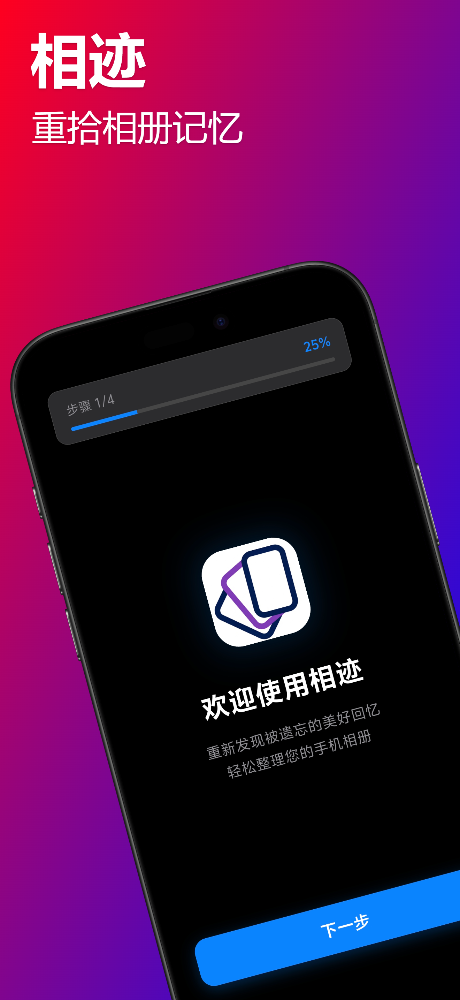

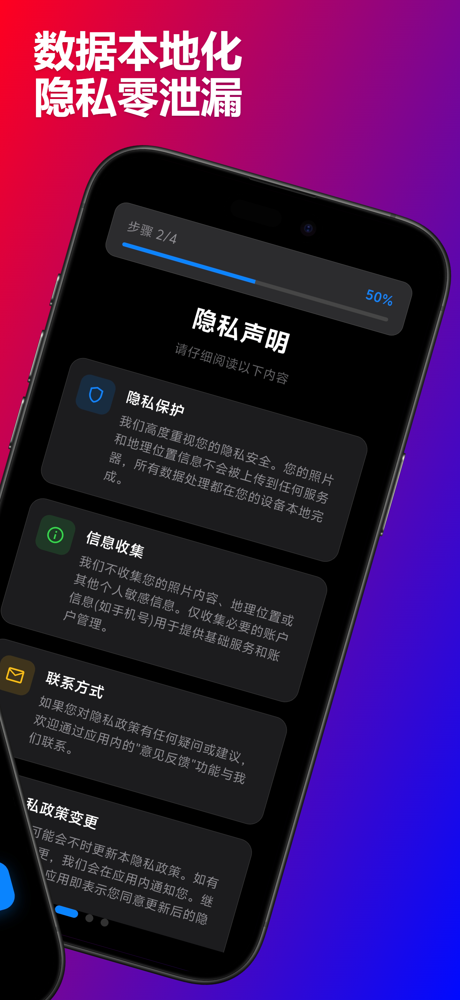

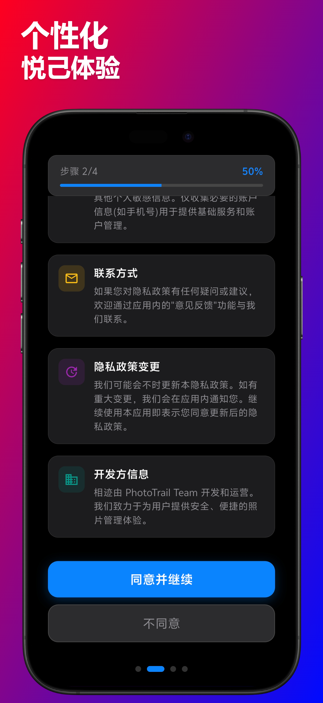

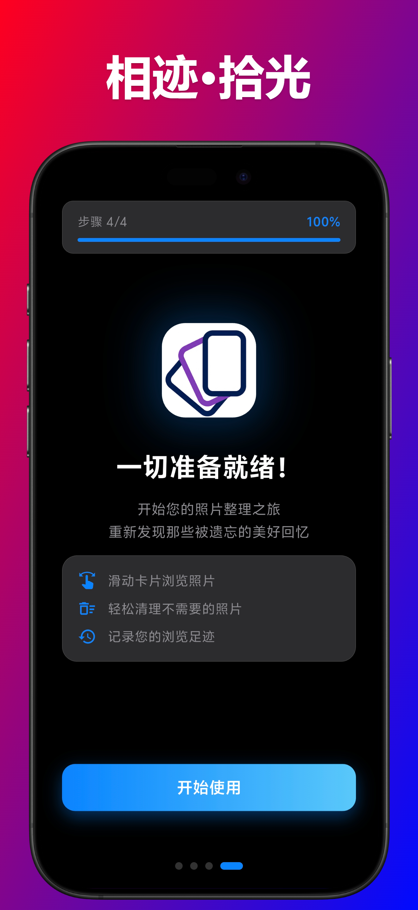


## 会员体系

相迹采用免费 + VIP 的商业模式：

**免费用户：**
- 每日浏览限制
- 基础功能使用

**VIP 会员：**
- 无限制浏览
- 解锁全部高级功能
- 支持日卡、月卡、终身会员

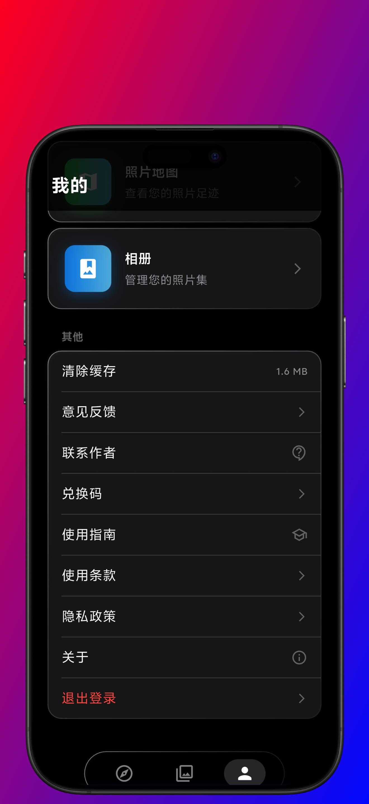

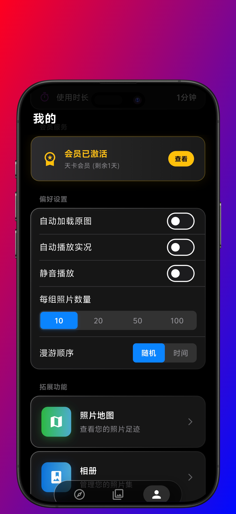

## 下载与使用

### 平台支持

- **Android**：已在 vivo 应用商店上架
- **iOS**：暂不支持（开发者账号限制）

### 下载方式

1. **vivo 应用商店**：搜索"相迹"或"PhotoTrail"
2. **官网下载**：访问 [www.rookiefish.com](http://www.rookiefish.com) 获取最新版本
3. **APK 直接安装**：从官网下载 APK 文件安装

### 系统要求

- Android 5.0（API 21）及以上
- 建议 2GB 以上内存
- 需要存储和位置权限

## 隐私与安全

相迹非常重视用户隐私：

- **本地优先**：照片数据不上传服务器，仅在本地处理
- **安全存储**：敏感信息使用加密存储
- **最小权限**：仅申请必要的系统权限
- **透明政策**：完整的隐私政策和用户协议

```dart
// 安全存储实现
class SecureStorage {
  final FlutterSecureStorage _storage = FlutterSecureStorage();
  
  Future<void> saveToken(String token) async {
    await _storage.write(key: 'auth_token', value: token);
  }
}
```

## 未来规划

相迹还在持续迭代中，计划中的功能包括：

- **AI 照片分类**：自动识别照片内容并分类
- **智能相册生成**：根据时间、地点自动生成主题相册
- **云端同步**：支持多设备数据同步
- **社交分享**：生成精美的足迹地图分享卡片
- **视频支持**：扩展到视频管理
- **3D 地图**：更炫酷的地图展示效果

## 开发数据统计

用数据说话，这三个月的开发历程：

### 代码量统计

- **前端代码**：约 15,000 行 Dart 代码
- **后端代码**：约 3,000 行 Go 代码
- **配置文件**：约 500 行
- **文档**：约 10,000 字

### 功能模块

- **核心功能**：8 个主要模块
- **UI 组件**：50+ 个自定义组件
- **第三方库**：30+ 个依赖包
- **数据表**：6 个核心数据表

### 开发时间分配

- **编码时间**：约 200 小时
- **调试时间**：约 80 小时
- **UI 设计**：约 40 小时
- **测试优化**：约 60 小时
- **文档编写**：约 20 小时

### 遇到的挑战

- **重大 Bug**：修复了 50+ 个
- **功能迭代**：重构了 3 次核心功能
- **兼容性问题**：解决了 20+ 个平台差异
- **性能优化**：进行了 10+ 次优化

### 学习资源

- **官方文档**：Flutter、Go、各种库的文档
- **AI 对话**：与 Claude 的数千次对话
- **搜索引擎**：Google、Stack Overflow
- **视频教程**：YouTube、B站的教程视频

## 开发者的话

作为一名从零开始的 Flutter 小白，这次 AI 辅助开发的经历让我深刻体会到：

1. **AI 降低了编程门槛**：即使没有相关经验，也能实现自己的想法
2. **人机协作是未来**：AI 负责执行，人类负责创意和决策
3. **持续学习很重要**：通过这个项目，我真正学会了 Flutter 开发
4. **从 0 到 1 是可能的**：三个月，从完全不懂到应用上架

相迹的诞生证明了：**借助 AI，一个人也能完成复杂的应用开发**。这不是科幻，而是现实。

### 一些真实的感受

**最困难的时刻：**
- 第一次遇到内存溢出，应用直接崩溃，完全不知道从哪里开始排查
- 地图功能调试了整整一周，各种坐标转换问题让人抓狂
- 应用上架前的各种审核要求，文档准备了好几天

**最有成就感的时刻：**
- 第一次在真机上看到自己的应用运行起来
- 相似照片检测功能成功运行，看到结果的那一刻
- 收到第一个用户的反馈，说这个应用很有用
- 应用通过审核，正式上架的那一刻

**最感谢的：**
- Claude Code AI，我的编程导师和伙伴
- 开源社区，提供了大量优秀的库和工具
- 早期用户，给了很多宝贵的反馈和建议

### 我能帮你什么

- 分享 AI 辅助开发的经验和技巧
- 解答 Flutter 入门问题（我也是新手，但可以分享踩过的坑）
- 讨论产品设计和技术选型
- 如果你对项目转让感兴趣，可以详细沟通

### 你能帮我什么

- 使用反馈和改进建议
- Bug 报告
- 新功能想法
- 应用商店好评（如果你喜欢的话）

**期待与你交流！** 😊


## 技术亮点总结

### 核心技术栈

| 层级 | 技术选型 | 说明 |
|------|---------|------|
| 前端框架 | Flutter 3.x | 跨平台 UI 框架 |
| 编程语言 | Dart 3.10+ | 前端开发语言 |
| 状态管理 | Provider | 轻量级状态管理方案 |
| 后端框架 | Go + Gin | 高性能 Web 框架 |
| 数据库 | MySQL 5.7+ | 关系型数据库 |
| ORM | GORM | Go 语言 ORM 框架 |
| 认证方式 | JWT | 无状态身份验证 |
| 地图服务 | Flutter Map | 开源地图组件 |

### 关键算法实现

1. **GPS 坐标转换**
```dart
// WGS-84 转 GCJ-02（火星坐标系）
class CoordTransform {
  static const double a = 6378245.0;
  static const double ee = 0.00669342162296594323;
  
  static LatLng wgs84ToGcj02(double lat, double lng) {
    // 实现坐标转换算法
  }
}
```

2. **图像相似度检测**
```dart
// 感知哈希算法
class PerceptualHash {
  String computeHash(Image image) {
    // 1. 缩放到 32x32
    // 2. 转灰度图
    // 3. 计算 DCT
    // 4. 提取低频信息
    // 5. 生成 64 位哈希
  }
  
  int hammingDistance(String hash1, String hash2) {
    // 计算汉明距离
  }
}
```

3. **LRU 缓存**
```dart
class LRUCache<K, V> {
  final int capacity;
  final LinkedHashMap<K, V> _cache = LinkedHashMap();
  
  V? get(K key) {
    if (!_cache.containsKey(key)) return null;
    final value = _cache.remove(key)!;
    _cache[key] = value; // 移到末尾
    return value;
  }
  
  void put(K key, V value) {
    if (_cache.containsKey(key)) {
      _cache.remove(key);
    } else if (_cache.length >= capacity) {
      _cache.remove(_cache.keys.first);
    }
    _cache[key] = value;
  }
}
```

### 性能优化技巧

1. **图片加载优化**
   - 使用缩略图预览
   - 实现三级缓存机制
   - 懒加载和虚拟滚动

2. **地图渲染优化**
   - 标记点聚合
   - 视口裁剪
   - 异步加载

3. **内存管理**
   - 及时释放不用的资源
   - 使用弱引用
   - 监控内存使用情况

## 常见问题

### 关于应用

**Q: 为什么不支持 iOS？**
A: 由于 iOS 开发者账号的限制和审核流程，目前暂不支持 iOS 平台。未来会考虑上架 App Store。作为个人开发者，iOS 开发者账号需要每年 99 美元，且审核周期较长，暂时精力有限。

**Q: 照片数据会上传到服务器吗？**
A: 不会。所有照片数据都在本地处理，服务器只存储用户账号信息和使用记录。我们非常重视用户隐私，照片永远不会离开你的手机。

**Q: 免费用户有什么限制？**
A: 免费用户每日有浏览次数限制（每天 50 张），升级 VIP 后可无限制使用所有功能。这样设计是为了维持服务器运营成本。

**Q: 如何备份数据？**
A: 目前支持本地相册管理，你创建的相册数据会保存在应用内。未来会推出云端同步功能，让你的数据更安全。

**Q: 应用会消耗很多电量吗？**
A: 应用已做了电量优化，正常使用不会明显增加耗电。建议在 WiFi 环境下进行相似照片检测等耗时操作，可以节省流量和电量。

**Q: 为什么需要位置权限？**
A: 应用需要读取照片的 GPS 信息来在地图上显示拍摄地点。我们不会收集你的实时位置，只读取照片中已有的位置信息。

**Q: 应用安全吗？**
A: 应用使用了多重安全措施：JWT 身份验证、HTTPS 加密传输、本地加密存储等。你的账号和数据都是安全的。

### 关于开发

**Q: 真的是零基础开发的吗？**
A: 是的。在开始这个项目之前，我从未接触过 Flutter，也没有移动应用开发经验。所有的知识都是在开发过程中边学边用。

**Q: 用了哪些 AI 工具？**
A: 主要使用 Claude Code（Claude Sonnet 4.5）。它不仅帮我写代码，还教我理解每一行代码的作用，是我的编程导师。

**Q: 开发过程中最大的困难是什么？**
A: 最大的困难是性能优化。大量照片加载时的内存管理、地图标记点的渲染优化等，都需要反复调试和优化。

**Q: 有开源计划吗？**
A: 目前暂无开源计划。如果项目转让不成功，未来可能会考虑开源部分代码，供学习参考。

**Q: 可以分享开发经验吗？**
A: 当然可以！欢迎通过应用内或平台私信联系我，我很乐意分享 AI 辅助开发的经验和技巧。

## 联系与交流

非常欢迎与大家交流 AI 开发经验和技术问题！

### 下载体验

- 🌐 **官网**：[www.rookiefish.com](http://www.rookiefish.com)
- 📱 **vivo 应用商店**：搜索"相迹"或"PhotoTrail"
- 💬 **应用内反馈**：个人中心 → 关于我们 → 反馈功能

### 交流合作

1. **应用内联系**
   - 下载相迹 APP
   - 进入"个人中心" → "关于我们"
   - 通过应用内反馈功能留言
   - 或查看联系方式直接沟通

2. **私信交流**
   - 在发布平台（掘金/知乎/CSDN 等）私信我
   - 我会尽快回复

3. **交流话题**
   - 💬 AI 辅助开发经验和技巧
   - 🎓 Flutter/Go 开发心得
   - 🤝 产品设计和技术选型
   - 💼 项目转让咨询（如有意向）

### 关于项目转让

如果你对这个项目感兴趣，**我考虑转让这个应用**（包括源码、服务器等资产）。

**转让包含：**
- ✅ 完整的 Flutter 前端源码
- ✅ Go 后端源码和数据库
- ✅ 服务器和部署环境
- ✅ 所有设计素材和文档
- ✅ 技术支持和交接培训

**适合人群：**
- 想要快速拥有一款成熟应用的创业者
- 对照片管理领域感兴趣的开发者
- 想要学习 Flutter + Go 全栈开发的团队
- 有运营能力想要接手现成产品的个人或公司

如有意向，欢迎通过上述方式联系交流！

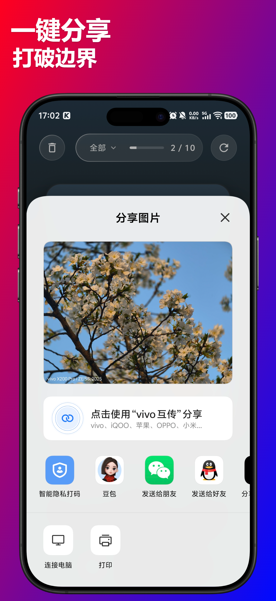

**Q: 为什么要转让？**
A: 作为个人开发者，精力有限。希望应用能得到更好的运营，让更多用户受益。同时也希望找到真正热爱这个产品的人来接手。

**Q: 转让价格是多少？**
A: 价格面议，会根据具体情况（整体转让还是部分授权、是否需要培训等）来确定。诚意者优先，也支持分期付款。

**Q: 转让后还会提供支持吗？**
A: 会提供 1-2 周的交接培训，包括技术细节、运营经验等。之后也可以提供有偿技术支持。

**Q: 可以只购买源码吗？**
A: 可以。可以根据你的需求定制转让方案，比如只购买源码、只授权使用、整体转让等。

---

## 结语

相迹 PhotoTrail 是一次 AI 辅助开发的成功实践，也是对照片管理方式的一次创新尝试。

**这个项目证明了：**
- 🎯 零基础也能借助 AI 开发应用
- ⏱️ 三个月就能从 0 到 1 上架应用商店
- 🤖 Claude Code 是强大的开发伙伴
- 💡 好的想法 + AI 工具 = 无限可能

如果你也被手机里成千上万张照片困扰，不妨下载相迹试试看。如果你也想尝试 AI 辅助开发，希望我的经历能给你一些启发。

**立即下载：**
- 📱 vivo 应用商店搜索"相迹"
- 🌐 访问 www.rookiefish.com

**关键词：** #照片管理 #地图应用 #AI开发 #Flutter #Go #Claude #零基础开发 #移动应用 #相册整理 #足迹记录 #旅行回忆 #项目转让

---

*欢迎转载，请注明出处。欢迎交流，期待你的反馈！*